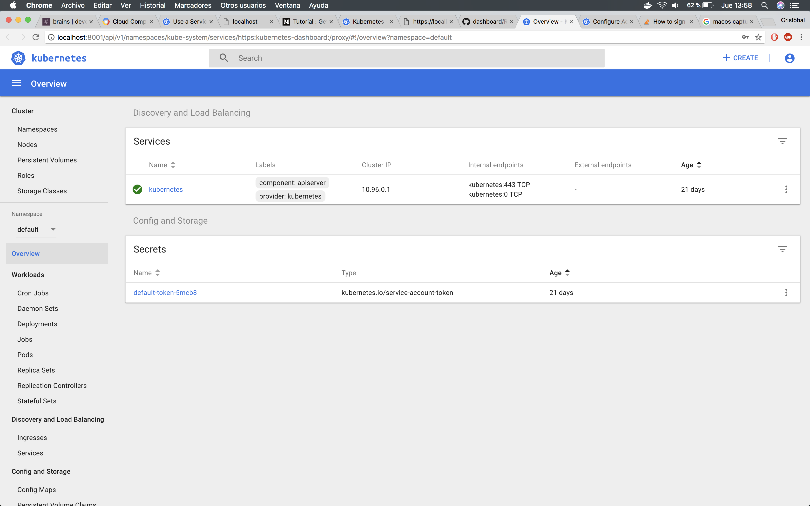

# k8s-macosX-installation

## 1. Install Edge version of Docker and Enable Kubernetes
````
$ docker -v
Docker version 17.12-kube_beta, build ca0c9dbcb219048a1a61fbf82a2e69f1b9795023
````
Docker Version 17.12.0-ce-mac45

## 2. Activate Kubernetes support

https://docs.docker.com/docker-for-mac/#edit-the-daemon-configuration-file

## 3. Install `kubectl` (if not installed)

`$ brew install kubectl`

## 4. Set k8s context to docker-for-desktop

`$ kubectl config use-context docker-for-desktop`

## 5. Install the **Kubernetes Dashboard**

Follow the Official README steps: https://github.com/kubernetes/dashboard#getting-started

## 6. Find the **Deployment Controller Token** secret

```
$ kubectl -n kube-system get secret

NAME                                     TYPE                                  DATA      AGE
...
deployment-controller-token-XXXX        kubernetes.io/service-account-token   3         21d
...
```

## 7. "Describe" the secret to get the `token`

````
$ kubectl -n kube-system describe secret deployment-controller-token-XXXX

Name:         deployment-controller-token-XXXX
Namespace:    kube-system
Labels:       <none>
Annotations:  kubernetes.io/service-account.name=deployment-controller
              kubernetes.io/service-account.uid=XXXXXXXXX-XXXX-XXXX-XXXX-XXXXXXXXXXXX

Type:  kubernetes.io/service-account-token

Data
====
ca.crt:     1025 bytes
namespace:  11 bytes
token:      eyJhbGciOiJSUzI1NiIsInR5cCI6IkpXVCJ9.eyJpc3Mi...
````

## 8. Set admin token

`$ kubectl config set-credentials cluster-admin --token=${SECRET_TOKEN}`

## 9. Navigate to the k8s dashboard

http://localhost:8001/api/v1/namespaces/kube-system/services/https:kubernetes-dashboard:/proxy/

## 9. Enter the token under the second option and SIGN IN


